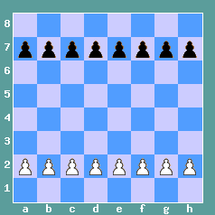
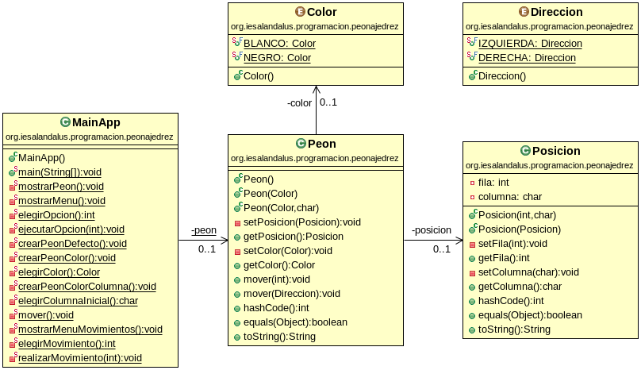

# Tarea Peón Ajedrez
## Profesor: José Ramón Jiménez Reyes
## Alumno:

La tarea va a consistir en modelar el movimiento de un peón de ajedrez por el tablero de dicho juego.

    
    
    

Imágenes obtenidas de la web: <a href="https://www.123ajedrez.com/reglas-basicas/el-peon">123ajedrez.com</a> (Enrique Moreno)

En la primera imagen puedes observar cuál es el posicionamiento inicial válido para un peón dependiendo de su color.

En la segunda imagen puedes apreciar cuáles son los movimientos válidos para un peón. Como se puede observar, se puede mover avanzando una posición siempre que no se salga del tablero. Se puede mover avanzando dos posiciones, si y solo si, parte de su posición inicial. No tendremos en cuenta que no se puede mover cuando tiene una pieza delante ya que lo único que queremos es modelar su movimiento. Un peón no puede retroceder.

En la tercera imagen puedes ver cuáles son los movimientos válidos que el peón puede utilizar para comer otra pieza: avanzar una posición hacia la izquierda (en la imagen comería al caballo) y avanzar una posición hacia la derecha (en la imagen comería al alfil).

También debes tener en cuenta que las imágenes muestran el caso para el peón blanco. Para el peón negro, su avance sería decrementar el número de fila, en vez de incrementar como lo hace el blanco. Para la izquierda y derecha se toma como base la perspectiva del blanco, por lo que, por ejemplo, avanzar hacia la izquierda para un peón negro, decrementaría en uno su fila y decrementaría en uno su columna.

En este repositorio hay un esqueleto de proyecto gradle que ya lleva incluidos todos los test necesarios que el programa debe pasar.

Para ello te pongo un diagrama de clases para el mismo y poco a poco te iré explicando los diferentes pasos a seguir:

    

1. Lo primero que debes hacer es hacer un `fork` del repositorio donde he colocado el esqueleto de este proyecto.
2. Clona tu repositorio remoto recién copiado en GitHub a un repositorio local que será donde irás realizando lo que a continuación se te pide. Modifica el archivo `README.md` para que incluya tu nombre en el apartado "Alumno". Haz tu primer commit.
3. Crea un enumerado llamado `Color`, dentro del paquete adecuado, que contenga los valores: `BLANCO` y `NEGRO`. Haz un commit.
4. Crea un enumerado llamado `Direccion`, dentro del paquete adecuado, que contenga los valores: `IZQUIERDA` y `DERECHA`.  Haz un commit.
5. Crea la clase Posicion. Crea los atributos `fila` (int) y `columna` (char) con la visibilidad adecuada. Haz un commit.
6. Crea los métodos `get` y `set` para los atributos. Recuerda que para el método `set` se debe tener en cuenta que los valores son correctos (las filas van del 1 al 8 -ambos inclusive- y las columnas de la 'a' a la 'h' -ambas inclusive-)  y si no se lance una excepción del tipo `IllegalArgumentException` con el mensaje adecuado y no modifique los atributos. Haz un commit.
7. Crea un constructor para esta clase que acepte como parámetros la fila y la columna y que los asigne a los atributos si son correctos  y si no lance una excepción del mismo tipo que la anterior indicando el problema. Para ello utiliza los métodos `set` anteriormente creados. Haz un commit.
8. Crea el constructor copia para esta clase. Haz un commit.
9. Crea los métodos `equals` y `hashCode` para esta clase. Haz un commit.
10. Crea el método `toString` que devolverá un `String` y será la representación de la fila y la columna. Haz un commit.
11. Crea la clase `Peon`, dentro del paquete adecuado, cuyos atributos serán un `color` (del tipo enumerado `Color`) y posicion (de la clase `Posicion`), con la visibilidad adecuada. Haz un commit.
12. Crea los métodos `get` y `set` para cada atributo con la visibilidad adecuada. Estos métodos siempre comprobarán la validez de los parámetros pasados y si no son correctos deberá lanzar la excepción adecuada (`NullPointerException` o `IllegalArgumentException`) con el mensaje adecuado. Haz un commit.
13. Crea un constructor por defecto para esta clase que cree un peón negro en la posición '7d'. Haz un commit.
14. Crea un constructor para la clase que acepte como parámetro el color y que creará un peón de dicho color cuya posición será '2d' si es blanco o '7d' si es negro. Haz un commit.
15. Crea un constructor para la clase que acepte como parámetros el color y la columna inicial. La columna inicial debe ser válida (de lo contrario debe lanzar la excepción `IllegalArgumentException` con un mensaje adecuado) y creara un peón del color dado y colocado en dicha columna y cuya fila será la 2 si es blanco y la 7 si es negro. Haz un commit.
16. Crea el método `mover` que acepte como parámetro una `Direccion` y dependiendo de dicha dirección modificará la posición del mismo. Si no puede realizar dicho movimiento debe lanzar una excepción del tipo `OperationNotSupportedException` con un mensaje adecuado y no modificará la posición del peón. Haz un commit.
17. Sobrecarga el método `mover` que acepte como parámetro un entero y que dependiendo del entero modificará la posición del mismo el número de pasos indicado por dicho entero. Si no puede realizar dicho movimiento debe lanzar una excepción del tipo `OperationNotSupportedException` con un mensaje adecuado y no modificará la posición del peón. Haz un commit.
18. Crea los métodos `equals` y `hashCode` para esta clase. Haz un commit.
19. Crea el método  `toString` que devuelva un `String` que será la representación de dicho objeto (color y posición). Haz un commit.
20. Crea los diferentes métodos que se indican en el diagrama de clases para permitir que el método `main` nos muestre un menú que nos permitirá crear un peón por defecto, crear un peón de un color, crear un peón de un color en una columna inicial dada, mover el peón y salir. Después de cada operación se nos mostrará el estado actual de nuestro peón. El menú se repetirá mientras no elijamos la opción salir. En todo caso se debe validar que todas las entradas al programa son correctas. Para ello implementa los siguientes métodos:
    1. `void mostrarPeon()`: mostrará por consola la representación del peón representado por el atributo de clase `peon` (crea el atributo si aún no lo has hecho). Haz un commit.
    2. `void mostrarMenu()`: mostrará por consola el menú con las diferentes opciones de nuestro programa. Haz un commit.
    3. `int elegirOpción()`: Nos mostrará un mensaje para que elijamos una opción del menú anteriormente creado y nos pedirá que introduzcamos por teclado la opción hasta que ésta sea valida. Devolverá la opción elegida. Haz un commit.
    4. `Color elegirColor()`: Nos preguntará que elijamos un color mientras éste no sea válido y dependiendo de la opción elegida devolverá un color u otro. Haz un commit.
    5. `char elegirColumnaInicial()`: Nos preguntará que elijamos la columna inicial mientras ésta no sea válida y devolverá la columna elegida. Haz un commit.
    6. `void mostrarMenuMovimientos()`: Mostrará por consola un menú con los diferentes movimientos que podemos realizar: avanzar peón un paso, avanzar peón dos pasos, avanzar peón hacia la izquierda y avanzar peón hacia la derecha. Haz un commit.
    7. `int elegirMovimiento()`: Nos mostrará un mensaje para que elijamos una opción del menú anteriormente creado y nos pedirá que introduzcamos por teclado la opción hasta que ésta sea valida. Devolverá la opción elegida. Haz un commit.
    8. `void realizarMovimiento(int)`: Dependiendo de la opción asociada al movimiento del menú de movimientos, realizará un movimiento u otro. Haz un commit.
    9. `void crearPeonDefecto()`: Asignará al atributo de clase `peon` una nueva instancia de un peón creado con el constructor por defecto. Haz un commit.
    10. `void crearPeonColor()`: Asignará al atributo de clase `peon` una nueva instancia de un peón creado con el constructor al que le pasamos el color. Este método debe utilizar métodos ya implementados anteriormente. Haz un commit.
    11. `void crearPeonColorColumna()`: Asignará al atributo de clase `peon` una nueva instancia de un peón creado con el constructor al que le pasamos el color y la columna inicial. Este método debe utilizar métodos ya implementados anteriormente. Haz un commit.
    12. `void mover()`: Mostrará un menú con los posibles movimientos, nos preguntará cual queremos realizar y lo realizará. Este método debe utilizar métodos ya implementados anteriormente. Haz un commit.
    13. `void ejecutarOpcion(int)`: Depediendo de la opción pasada como parámetro, actuará en consecuencia. Este método debe utilizar métodos ya implementados anteriormente. Haz un commit.
    14. `void main(String[])`: Método principal de nuestra aplicación que deberá realizar lo que se pide en el apartado 20 y que debe apoyarse en los métodos anteriormente implementados. Haz un commit y realiza el push a tu repositorio remoto en GitHub.

#### Se valorará:

    - La indentación debe ser correcta en cada uno de los apartados.
    - El nombre de las variables debe ser adecuado.
    - Se debe utilizar la clase Entrada para realizar la entrada por teclado.
    - El programa debe pasar todas las pruebas que van en el esqueleto del proyecto y toda entrada del programa será validada, para evitar que el programa termine abruptamente debido a una excepción.
    - La corrección ortográfica tanto en los comentarios como en los mensajes que se muestren al usuario.